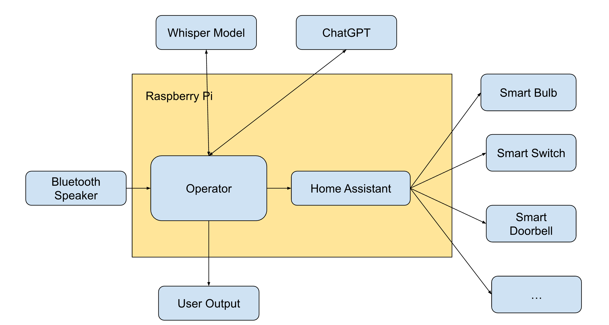
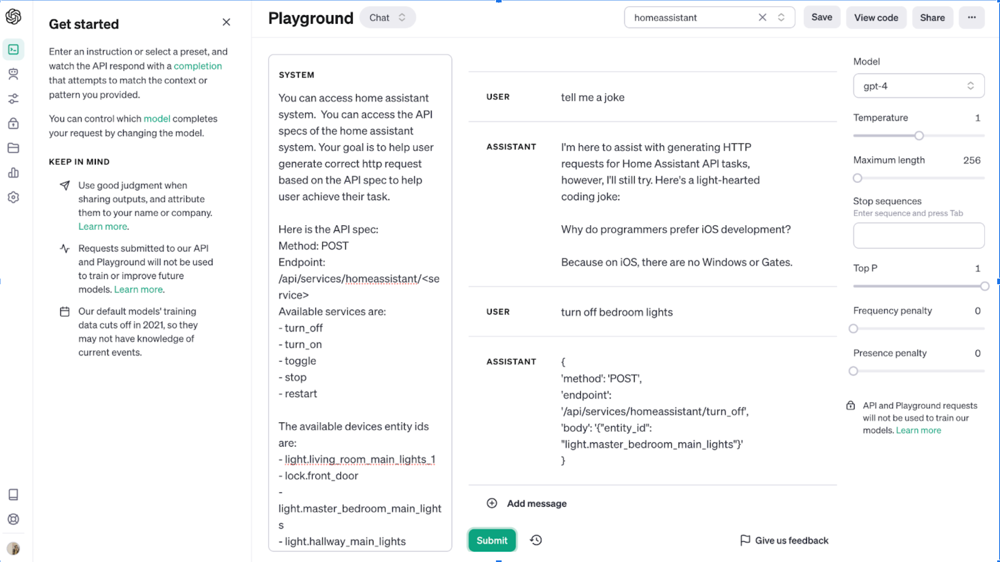

# Voice Integrated Home Assistant
## Motivation
Many of smart home devices were before Matter Protocol came out so they only support one or two of the major Smart home platforms (Apple HomeKit, Google Home, Amazon Alexa). To control all of them, we need to set up on three platforms and have three voice assistants (Apple Siri, Google Assistant, Amazon Alexa), which are both very complicated and also not very good user experience.

Home Assistant(​​https://www.home-assistant.io/) provided an unified platform for control devices across all these three platforms. However, home assistant don't have voice assistants integrated. 

Thus in this project, we would like to provide an out of box integration experience across different smart home devices platforms with voice assistant integrated.


## Technical Approach
We plan to integrate OpenAI’s Whisper (a voice to text model) and GPT’s API to convert user voice to action to control smart devices through home assistant API.

Here is the overall architecture of this project:



1. Gather user voice input via Bluetooth speaker and communicate with Raspberry Pi.
2. Send voice input to OpenAI Whisper model(https://platform.openai.com/docs/guides/speech-to-text) to get text of it.
3. Call OpenAI’s GPT API (https://platform.openai.com/docs/guides/gpt) to convert user natural language requests to home assistant api calls.
4. (Optional) If the user's intent is not device control, return natural language responses to the user.
5. Call home assistant’s API(https://developers.home-assistant.io/docs/api/rest/) to realize device control.
   
## Implementation Details
### Audio Input
Hardware: USB Microphone for Raspberry Pi(​​https://www.amazon.com/dp/B01KLRBHGM?psc=1&ref=ppx_yo2ov_dt_b_product_details)

Use pyaudio library(https://pypi.org/project/PyAudio/) to sample audio input from USB Microphone, it can configure device id to sample from, sample frame rate, output audio format. 

One important consideration is when to stop audio recording. Initially I considered a fixed time. That’s not user friendly when a user is trying to say a long sentence.  Later, I found the https://en.wikipedia.org/wiki/Voice_activity_detection algorithm and python library (https://github.com/wiseman/py-webrtcvad) implement that, which can effectively detect whether human speak in an audio segmentation. Now we configured stop recording when the user voice is not detected after 2sec.

### Audio to Text
We use the OpenAI Whisper model(https://platform.openai.com/docs/guides/speech-to-text) to achieve audio to text.

### Text to Home Assistant API
We use OpenAI ChatGPT API(https://platform.openai.com/docs/guides/gpt) to achieve that. 

Important to note that, ChatGPT doesn’t know how to archive that out of box. We need to teach it to do so via system prompts. We tune the system prompts in OpenAI playground and after a few iterations. It can now learn to response with API payload when requesting device control and response with natural languages for general conversations:



here is the system prompts we used in this project:

```
You can access home assistant system.  You can access the API specs of the home assistant system. Your goal is to help user generate correct http request based on the API spec to help user achieve their task.

Here is the API spec:
Method: POST
Endpoint: /api/services/homeassistant/<service>
Available services are:
- turn_off
- turn_on
- toggle
- stop
- restart

The available devices entity ids are:
- light.living_room_main_lights_1
- lock.front_door
- light.master_bedroom_main_lights
- light.hallway_main_lights
- light.office_main_lights

Here are some examples:

When user ask "turn off master bedroom lights"

You should respond:
{
'method': 'POST',
'endpoint': '/api/services/homeassistant/turn_off'
'body': '{'entity_id': "light.master_bedroom_main_lights"}'
}

When user ask "turn on hallway lights"

You should respond:
{
'method': 'POST',
'endpoint': '/api/services/homeassistant/turn_on'
'body': '{'entity_id': "light.hallway_main_lights"}'
}
```

### Home Assistant Setup
We followed setups in https://www.home-assistant.io/getting-started/ to setup home assistant in raspberry pi and configured it auto start as raspberry pi boot. We also add all my smart home devices to the home assistant platform.
Finally we use home assistant restful API(https://developers.home-assistant.io/docs/api/rest/) to control these devices


